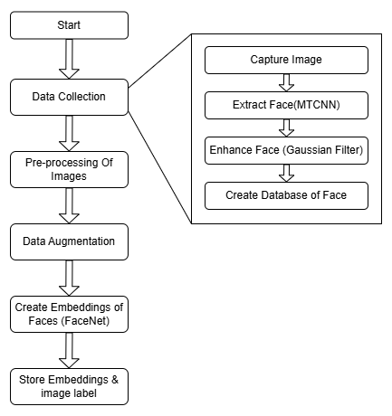
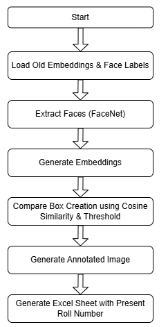
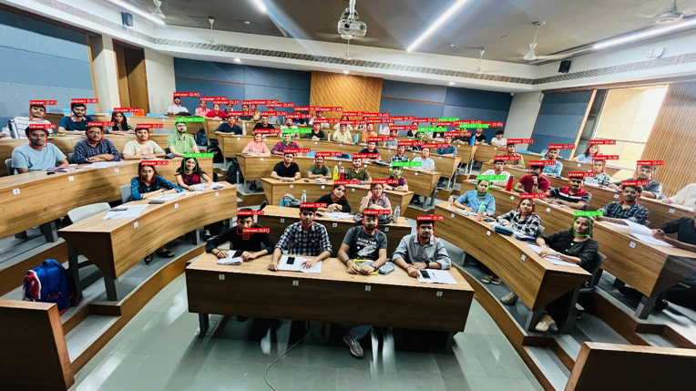

# 🎲 **Automatic Attendance System**

> This project was created as part of my CVDL Innovative Assignment in the 6th semester.

---

## 📜 Project Description
> This project implements a **Automatic Attendance System** using FaceNet and MTCNN to solve the problems of Traditional methods of roll call that are time-consuming and prone to human error.

---

---

## ❓ Problem Statement
> Traditional methods of attedance system can be prone to human error like missed names, incorrect entries or miscounts. Also, traditional systems are vulnerable to proxy attendance. Maintaining paper-based records requires physical storage also. This project eliminates this issue by providing AI-based solution for attedance system.

---

## 🔩 Components Used
✅ **FaceNet** – Generates face embeddings. 
✅ **MTCNN** – for Face Recognition
✅ **Augmentor** – for Data Augmentation. 

---

## 📥 Why this Solution
**MTCNN vs YOLO :**
> MTCNN outperforms YOLO in detecting multiple faces in group photos, handling occlusions and overlapping faces better. YOLO struggles with crowded scenes, often missing faces or detecting them incorrectly, especially when faces are close together. MTCNN is more reliable in varied environments (e.g., classrooms or events) where faces may not be fully visible or evenly lit.

**FaceNet for Embedding Generation :**
> FaceNet creates high-quality embeddings that remain consistent even under lighting and angle variations, making it ideal for attendance systems.

---

## ⚙️ Solution 


> Images are collected in group photos since it is not possible to capture each student's face individually.
> MTCNN is used to detect and extract faces from the group photo.
> Gaussian filters are applied to enhance image quality, improving recognition accuracy in low-resolution images.
> The extracted and enhanced face images are stored in a database, along with their labels (student IDs).
> Image pre-processing and Data augmentation techniques (e.g., rotation, flipping) are applied to the images to increase the dataset size and improve model generalization.


> FaceNet generates embeddings for each face image. These embeddings are vector representations of the facial features, allowing for precise comparisons.
> The embeddings and their corresponding labels are stored in a database for easy retrieval during inference.
> At inference, the system loads embeddings, detects faces with MTCNN,  generates embeddings using FaceNet, compares them with stored embeddings, and annotates the image. It then generates an Excel sheet with the roll numbers of present students.

---

## 📊 Results


> Without Augmentation : The model correctly predicted 9/23 faces, showing limited accuracy due to lack of variability in training data.


> With Augmentation: After applying data augmentation techniques, the model's accuracy improved, correctly predicting 14/23 faces. 

---

## 📤 Conclusion 

> The Face Attendance Recognition System, using MTCNN for detection and FaceNet for embeddings, faced challenges with limited data. 
> With only 23 labeled images, data augmentation (flipping, scaling, brightness) was applied to improve performance. Switching to MTCNN improved face detection, and FaceNet enhanced matching accuracy. 
> After augmentation, correct predictions increased from 9 to 14, proving the effectiveness of data augmentation in boosting model performance for real-world attendance tracking.

---
```
---

## 📞 Contact
🔗 [LinkedIn](https://www.linkedin.com/in/akshat-jingar/)  
